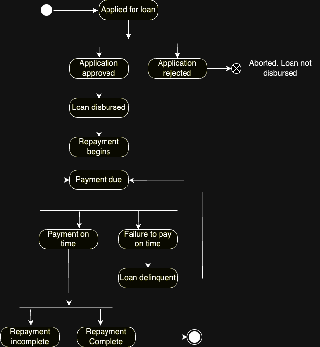

###  improve Citi's loan management system and stock market risk reporting.
### Created a state diagram of the loan management process using the Unified Modeling Language (UML).


## Financial Stock Data Visualizer
Used Java to build an internal tool visualizing stock market risk in real time.  It creates a line chart showing the monthly closing prices of IBM stock over the past year.

## Project Structure
The project is structured as follows:
```bash

fin_page/ ├── app/ │ └── src/ │ └── main/ │ └── java/ │ └── org/ │ └── example/ │ └── App.java └── fin_page.code-workspace
```

## Prerequisites

- Java Development Kit (JDK) 8 or higher
- Gradle build tool
- An Alpha Vantage API key

## Setup

1. Clone the repository:
```bash
git clone https://github.com/tangminhanh/fin_page.git
```
2. Set up your Alpha Vantage API key (see "Handling API Keys" section below).

3. Build the project:
```bash
gradle build
```

## Running the Application

To run the application, use the following command:

gradle run


This will start the JavaFX application, displaying a line chart of IBM's stock prices.

## Handling API Keys

To securely handle your API key:

1. Create a file named `config.properties` in the `src/main/resources` directory.
2. Add your API key to this file: